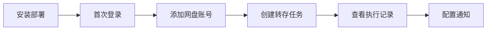

# 使用指南

欢迎使用 PanBox 网盘自动转存系统！本指南将帮助你快速上手使用 PanBox。

## 快速导航

### 新手入门

- [快速开始](/guide/getting-started) - 5 分钟快速上手
- [安装部署](/guide/installation) - 详细安装步骤
- [创建第一个任务](/guide/first-task) - 新手教程

### 高级配置

- [环境变量](/advanced/environment-variables) - 环境变量配置
- [数据备份](/advanced/database-backup) - 数据库备份与恢复
- [自定义域名](/advanced/custom-domain) - 配置自定义域名
- [反向代理](/advanced/reverse-proxy) - Nginx 反向代理

## 系统要求

<div class="tip custom-block">
<p class="custom-block-title">💡 推荐配置</p>

- **操作系统**：Linux（Ubuntu 20.04+、Debian 11+、CentOS 8+）
- **Docker**：20.10+
- **内存**：至少 512MB RAM（推荐 1GB+）
- **存储**：至少 1GB 可用空间
- **权限**：root 或 sudo

</div>

## 核心功能

| 功能 | 描述 |
|------|------|
| **多网盘支持** | 支持百度网盘、夸克网盘、UC网盘 |
| **定时转存** | 使用 Cron 表达式灵活配置定时任务 |
| **智能过滤** | 支持正则表达式过滤文件名 |
| **批次通知** | PushPlus 多渠道聚合通知 |
| **状态追踪** | 详细的执行日志和状态记录 |
| **License 管理** | 多套餐支持，Free 套餐永久免费 |

## 快速开始

选择适合你的安装方式：

::: code-group

```bash [一键安装（推荐）]
# 国内用户使用代理加速
curl -fsSL https://gh-proxy.org/https://raw.githubusercontent.com/kokojacket/panbox-autosave-open/main/install.sh | sudo bash

# 海外用户使用原始地址
curl -fsSL https://raw.githubusercontent.com/kokojacket/panbox-autosave-open/main/install.sh | sudo bash
```

```bash [手动安装]
# 下载安装脚本
curl -fsSL https://gh-proxy.org/https://raw.githubusercontent.com/kokojacket/panbox-autosave-open/main/install.sh -o install.sh

# 添加执行权限
chmod +x install.sh

# 运行脚本
sudo ./install.sh
```

:::

安装完成后，访问 `http://your-server-ip:1888` 开始使用！

## 学习路线



## 常见问题

- **Q: 支持哪些网盘？**
  A: 支持百度网盘、夸克网盘、UC网盘。

- **Q: 如何添加网盘账号？**
  A: 支持扫码登录和 Cookie 登录两种方式，详见 [账号管理](/features/account-management)。

- **Q: 如何设置定时任务？**
  A: 使用标准 Cron 表达式，详见 [任务管理](/features/task-management)。

- **Q: 数据是否安全？**
  A: PanBox 是本地部署的自托管应用，所有数据完全由你掌控。

## 获取帮助

遇到问题？我们随时为你提供帮助：

- 📖 查看 [常见问题 FAQ](/faq)
- 🔧 查看 [故障排查](/troubleshooting)
- 💬 前往 [GitHub Discussions](https://github.com/kokojacket/panbox-autosave/discussions) 讨论
- 🐛 提交 [Issue](https://github.com/kokojacket/panbox-autosave/issues)

---

<div class="tip custom-block">
<p class="custom-block-title">📌 下一步</p>

准备好了吗？让我们开始 [快速开始 →](/guide/getting-started)

</div>
